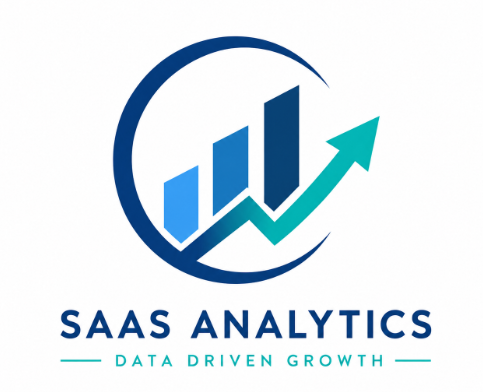
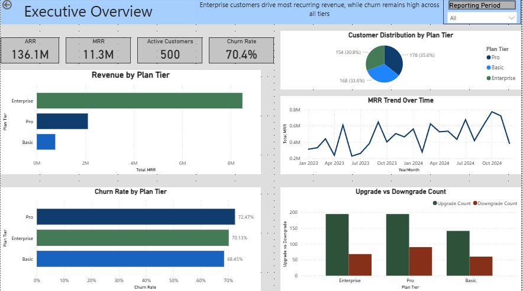
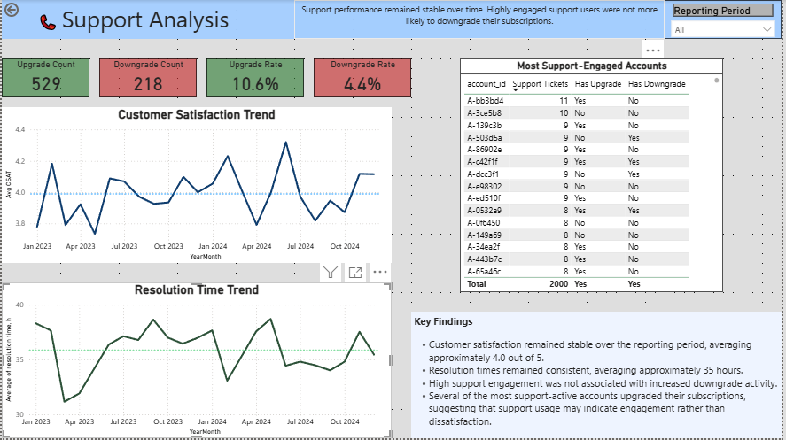
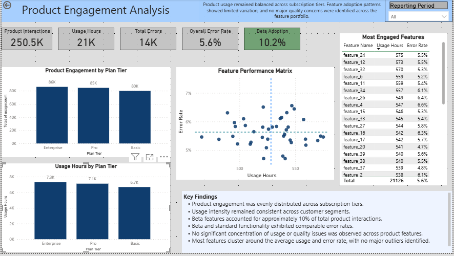
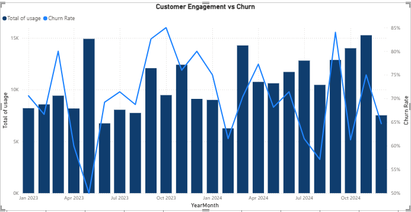

## 🚀 Project Overview

This Power BI project analyzes subscription performance, customer support operations, and product engagement within a SaaS business.

The goal was to identify potential drivers of revenue growth, subscription changes, customer satisfaction, and product adoption while providing executive-level insights through interactive dashboards.

---

## 🎯 Business Objectives

This analysis was designed to answer the following questions:

### 💰 Revenue & Growth

* Which subscription tier generates the most revenue?
* How are upgrades and downgrades distributed across plans?
* How has recurring revenue evolved over time?

### 🎧 Customer Support

* Does support performance influence subscription changes?
* Are highly engaged support users more likely to downgrade?
* How stable are customer satisfaction and resolution times?

### 📈 Product Engagement

* How actively do customers use the product?
* Are there differences in engagement across subscription tiers?
* How widely are beta features adopted?
* Do beta features exhibit higher error rates?

---

## 🗂️ Data Model

The solution was built using a star schema model.

### Fact Tables

* FactSubscriptions
* FactSupport
* FactUsage

### Dimension Tables

* DimAccounts
* DimDate

### Data Model Diagram


---

# 📊 Dashboard Pages

## 1️⃣ Executive Overview

Provides a high-level view of business performance, customer distribution, revenue generation, churn, and subscription activity.

### Key Insights

✅ Enterprise customers generate the majority of recurring revenue.

✅ Upgrade activity exceeds downgrade activity across all plans.

✅ Churn remains elevated across subscription tiers.

✅ MRR remains relatively stable throughout the reporting period.

### Dashboard Preview



---

## 2️⃣ Support Analysis

Evaluates customer satisfaction, resolution efficiency, and the relationship between support engagement and subscription outcomes.

### Key Insights

✅ Customer satisfaction remained stable throughout the reporting period.

✅ Resolution times showed limited variation over time.

✅ Highly engaged support users were not more likely to downgrade.

✅ No strong evidence was found that support interactions were a primary driver of subscription changes.

### Dashboard Preview



---

## 3️⃣ Product Engagement Analysis

Explores product adoption, feature usage patterns, beta feature adoption, and product quality metrics.

### Key Insights

✅ Product engagement was evenly distributed across subscription tiers.

✅ Usage intensity remained consistent across customer segments.

✅ Beta features accounted for approximately 10% of total product interactions.

✅ Beta and standard functionality exhibited comparable error rates.

✅ No significant concentration of usage or quality issues was identified across product features.

### Dashboard Preview



---

# 🔍 Additional Analysis

## Engagement and Churn Trend Analysis

An exploratory analysis was conducted to investigate whether declining product engagement could act as an early indicator of customer churn.

### Observation

While both engagement and churn fluctuated throughout the reporting period, no consistent inverse relationship was observed between usage levels and churn rates.

This analysis highlights the importance of validating business assumptions through data rather than relying solely on expected customer behavior.

### Analysis Preview



---

# 🛠️ Tools & Technologies

* Power BI
* DAX
* Power Query
* Data Modeling
* KPI Design
* Business Analytics
* Data Visualization

---

# 📌 Key Takeaways

### Business Performance

* Enterprise customers contribute the largest share of recurring revenue.
* Subscription upgrades outnumber downgrades across the customer base.
* Churn remains elevated across all subscription tiers.

### Customer Support

* Support quality remained stable over time.
* No meaningful relationship was identified between support activity and subscription changes.

### Product Engagement

* Product usage patterns remained balanced across plans and features.
* Beta adoption remains relatively low (~10%).
* Product quality metrics were consistent across customer segments.

---

# 📁 Repository Structure

```text
saas-subscription-analytics/
│
├── README.md
│
├── Dashboar/
│   ├── Executive_Overview.png
│   ├── Support_Analysis.png
│   ├── Product_Engagement_Analysis.png
│   └── Engagement_vs_Churn.png
│
├── data_model/
│   └── Data_Model.png
│
└── pbix/
    └── SaaS_Subscription_Analytics.pbix
```

⭐ Feel free to explore the dashboards and provide feedback.
