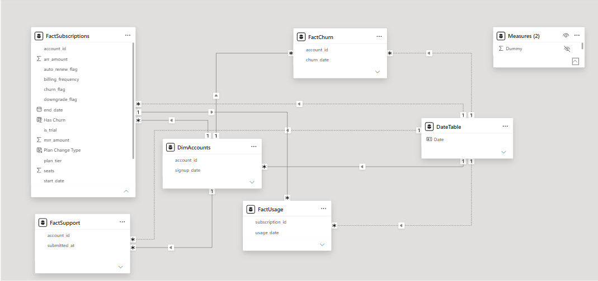

## 🚀 Project Overview

This Power BI project analyzes subscription performance, customer support operations, and product engagement within a SaaS business.

The goal was to identify potential drivers of revenue growth, subscription changes, customer satisfaction, and product adoption while providing executive-level insights through interactive dashboards.

This analysis was designed to answer the following questions:

### 💰 Revenue & Growth

* Which subscription tier generates the most revenue?
* How are upgrades and downgrades distributed across plans?
* How has recurring revenue evolved over time?

### 🎧 Customer Support

* Does support performance influence subscription changes?
* Are highly engaged support users more likely to downgrade?
* How stable are customer satisfaction and resolution times?

### 📈 Product Engagement

* How actively do customers use the product?
* Are there differences in engagement across subscription tiers?
* How widely are beta features adopted?
* Do beta features exhibit higher error rates?

---

## 🗂️ Data Model

The solution was built using a star schema model.

### Fact Tables

* FactSubscriptions
* FactSupport
* FactUsage

### Dimension Tables

* DimAccounts
* DimDate

### Data Model Diagram



---

# 📊 Dashboard Pages

## 1️⃣ Executive Overview

Provides a high-level view of business performance, customer distribution, revenue generation, churn, and subscription activity.

### Key Insights

✅ Revenue generation is heavily concentrated among Enterprise customers, highlighting the importance of retaining high-value accounts.

✅ Customer attrition remains elevated across all subscription tiers, suggesting retention opportunities throughout the customer base.

✅ Subscription activity indicates healthy movement between plans, with upgrade events occurring more frequently than downgrades.

✅ Revenue trends remained relatively stable during the reporting period despite fluctuations in customer behavior.

### Dashboard Preview


---

## 2️⃣ Support Analysis

Evaluates customer satisfaction, resolution efficiency, and the relationship between support engagement and subscription outcomes.

### Key Insights

✅ Support operations demonstrated consistent performance throughout the reporting period.

✅ Customer satisfaction levels remained stable, indicating a generally positive support experience.

✅ Resolution efficiency showed limited volatility, suggesting predictable service delivery.

✅ Analysis of support-intensive accounts did not reveal a clear connection between frequent support interactions and negative subscription outcomes.

### Dashboard Preview


---

## 3️⃣ Product Engagement Analysis

Explores product adoption, feature usage patterns, beta feature adoption, and product quality metrics.

### Key Insights

✅ Customers engaged with the platform at similar levels regardless of subscription tier.

✅ Feature usage patterns were broadly distributed, with no single feature dominating overall engagement.

✅ Beta functionality accounted for a modest share of product activity, indicating potential opportunities for increased adoption.

✅ Product quality metrics remained consistent across both beta and standard functionality, with no significant performance gaps identified.

✅ Feature-level analysis did not reveal notable outliers in either engagement or error rates.

### Dashboard Preview


---

# 🔍 Additional Analysis

## Engagement and Churn Trend Analysis

An exploratory analysis was conducted to investigate whether declining product engagement could act as an early indicator of customer churn.

### Observation

While both engagement and churn fluctuated throughout the reporting period, no consistent inverse relationship was observed between usage levels and churn rates.

This analysis highlights the importance of validating business assumptions through data rather than relying solely on expected customer behavior.

### Analysis Preview


---

# 🛠️ Tools & Technologies

* Power BI
* DAX
* Power Query
* Data Modeling
* KPI Design
* Business Analytics
* Data Visualization

---

# 📌 Key Takeaways

### Business Performance

* Enterprise customers contribute the largest share of recurring revenue.
* Subscription upgrades outnumber downgrades across the customer base.
* Churn remains elevated across all subscription tiers.

### Customer Support

* Support quality remained stable over time.
* No meaningful relationship was identified between support activity and subscription changes.

### Product Engagement

* Product usage patterns remained balanced across plans and features.
* Beta adoption remains relatively low (~10%).
* Product quality metrics were consistent across customer segments.

---

# 📁 Repository Structure

```text
saas-subscription-analytics/
│
├── README.md
│
├── Dashboar/
│   ├── Executive_Overview.png
│   ├── Support_Analysis.png
│   ├── Product_Engagement_Analysis.png
│   └── Engagement_vs_Churn.png
│
├── data_model/
│   └── Data_Model.png
│
└── pbix/
    └── SaaS_Subscription_Analytics.pbix
```

⭐ Feel free to explore the dashboards and provide feedback.
